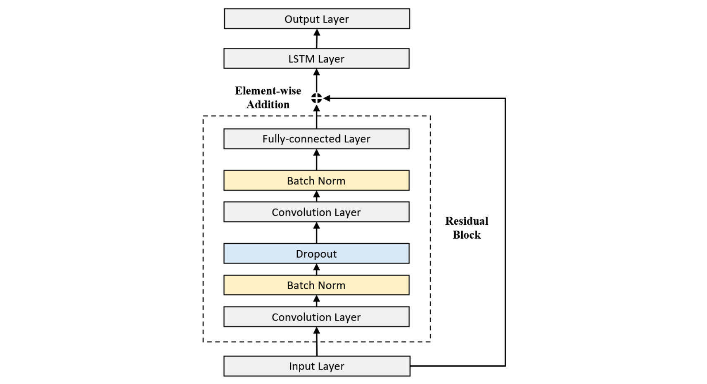

# Stock Price Forecasting

Code for [ResNLS: An Improved Model for Stock Price Forecasting](https://arxiv.org/abs/2312.01020v2), accepted at Computational Intelligence 2023.



## Model

Despite the wide adoption of machine learning and deep learning in stock price prediction, few approaches explicitly account for the varying degrees of dependency between adjacent stock prices. ResNLS addresses this by combining **ResNet** and **LSTM** into a hybrid architecture:

- **ResNet** acts as a feature extractor to capture dependencies between stock prices across time windows.
- **LSTM** analyzes the raw time-series data jointly with these dependency features (treated as residuals).

## Experiments

- **Dataset**: CSI 300 index (`sh.000001`), 2012–2022.
- **Input**: Closing prices of the previous 5 consecutive trading days.
- **Train/Test Split**: ~90% / ~10%.
- **Result**: ResNLS achieves at least **20% improvement** over state-of-the-art baselines. Backtesting confirms the trading strategy can mitigate losses in downturns and generate profits in uptrends.

## Usage

```bash
python src/resnls.py
```

## Project Structure

```
.
├── image/
│   └── resnls.png
├── src/
│   └── resnls.py
├── LICENSE.txt
├── README.md
├── requirements.txt
└── .gitignore
```
